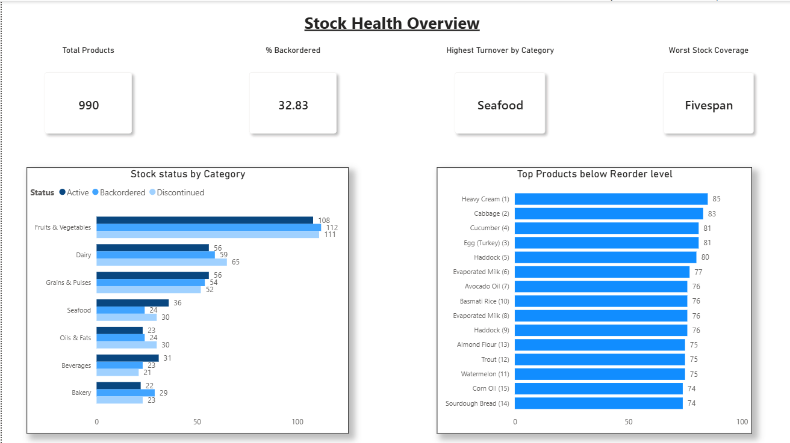
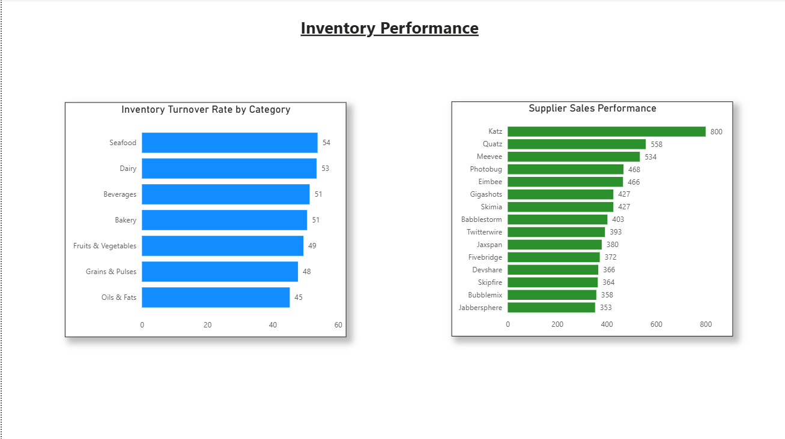

# Inventory Analytics — SQL & Power BI

## Project Overview
This project analyses inventory stock management for a 990-product grocery business using T-SQL (SSMS) and Power BI. The analysis identifies critical stock health issues, reorder risks, inventory turnover performance, and supplier effectiveness across seven product categories.

**Domain:** Supply Chain & Inventory Management  
**Tools:** Microsoft SQL Server Management Studio (T-SQL), Power BI Desktop  
**Dataset:** [Grocery Inventory and Sales Dataset — Kaggle](https://www.kaggle.com/datasets/salahuddinahmedshuvo/grocery-inventory-and-sales-dataset)  
**Database:** InventoryAnalytics | **Table:** InventoryData (990 rows)

---

## Business Questions
1. How does stock status (Active, Backordered, Discontinued) break down across product categories?
2. Which products have fallen below their reorder level and by how much?
3. Which categories turn stock over fastest, and which are slow movers?
4. Which suppliers generate the most sales volume and which underperform?
5. Which products are significantly overstocked, tying up capital and warehouse space?
6. What does the overall inventory health look like at an executive level?

---

## SQL Queries & Techniques

| Query | Business Question | Key Techniques |
|---|---|---|
| Query 1 — Stock Status by Category | Status breakdown per category | GROUP BY, COUNT, Window Function (OVER PARTITION BY) |
| Query 2 — Products Below Reorder Level | Reorder risk ranked by shortfall | WHERE filter, ROW_NUMBER(), calculated column |
| Query 3 — Inventory Turnover by Category | Fast vs slow moving categories | AVG, MAX, MIN, CAST, GROUP BY |
| Query 4 — Supplier Stock Performance | Supplier sales and stock efficiency | COUNT, AVG, SUM, calculated Sales_Per_Product |
| Query 5 — Overstock Analysis | Capital tied up in excess stock | WHERE filter, calculated Stock_Difference |
| Query 6 — Executive Inventory Summary | Single-row business snapshot | Scalar subqueries, TOP 1 with ORDER BY |

---

## Key Findings

### Stock Health (Query 1)
- No category exceeds 42% active stock — a company-wide availability problem
- Dairy is most critical: 36.11% discontinued and 32.78% backordered
- Bakery has the highest backorder rate at 39.19%

### Reorder Risk (Query 2)
- Heavy Cream is the most critical product: only 14 units on hand against a reorder level of 99 (shortfall of 85)
- Dairy and Fruits & Vegetables dominate the critical shortfall list
- Large reorder quantities across top products confirm these are high-volume, fast-moving lines

### Inventory Turnover (Query 3)
- Seafood leads turnover at an average rate of 53.73 despite being a smaller category
- Dairy's high turnover (53.43) combined with high backorder rates confirms demand is outpacing supply
- Oils & Fats is the slowest mover at 45.22 — potential deadstock risk

### Supplier Performance (Query 4)
- Katz is the largest supplier: 12 products and 800 total sales volume
- Browsetype is the most efficient: 87.50 sales per product from only 4 products
- Fivespan holds high average stock but generates weak sales — poor inventory deployment
- Bottom 16 suppliers each supply only 1 product; Eamia and Muxo are weakest at 21 sales volume each

### Overstock Analysis (Query 5)
- 524 of 990 products (52.9%) are overstocked
- Top overstocked products have reorder levels as low as 1–10 while carrying 90–100 units
- Combined with Query 2, the business faces a split inventory problem: simultaneous overstock and stockout across different product lines
- Duplicate product names reflect legitimate multi-supplier sourcing, not data quality issues

### Executive Summary (Query 6)
- 990 total products | 32.83% backordered | Seafood highest turnover | Fivespan worst stock coverage

---

## Power BI Dashboard

### Page 1 — Stock Health Overview

### Page 2 — Inventory Performance

**Colour convention:** Blue = operational metrics | Green = financial metrics

---

## Technical Notes
- `ROW_NUMBER()` used in Query 2 to generate unique row identifiers, resolving Power BI aggregation issues caused by duplicate product names across multiple suppliers
- `OVER (PARTITION BY)` used in Query 1 to calculate per-category percentages without collapsing rows
- `CTEs cannot be nested inside scalar subqueries in T-SQL` — TOP 1 with ORDER BY used in Query 6 instead
- `CAST` wraps the column inside AVG for numeric precision — not the result of AVG
- Inventory_Turnover_Rate imported as FLOAT to preserve decimal values (tinyint default truncates decimals)

---

## Other Projects
- [Project 1 — Supply Chain Performance Analysis (SQL + Power BI)](https://github.com/jurgensp09-ship-it/Supply-Chain-SQL-Analysis)
- [Project 2 — Sales & Employee Performance Analysis (SQL + Power BI)](https://github.com/jurgensp09-ship-it/Sales-Employee-Performance-SQL-PowerBI)
- [Project 3 — HR Analytics: Employee Attrition & Performance (SQL + Power BI)](https://github.com/jurgensp09-ship-it/HR-Analytics-SQL-PowerBI)
